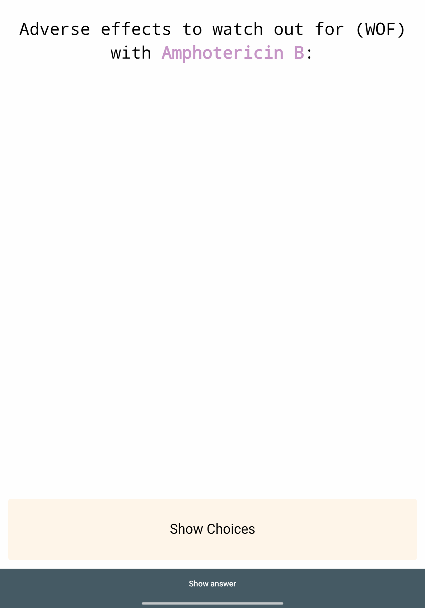
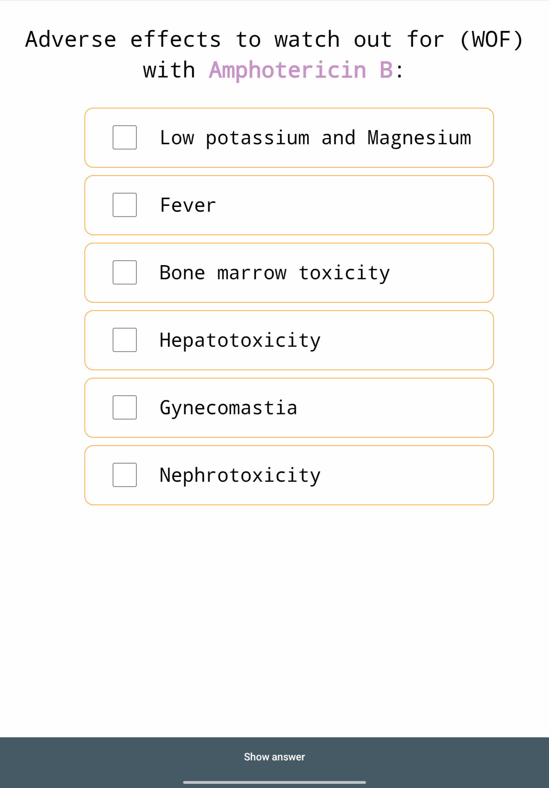
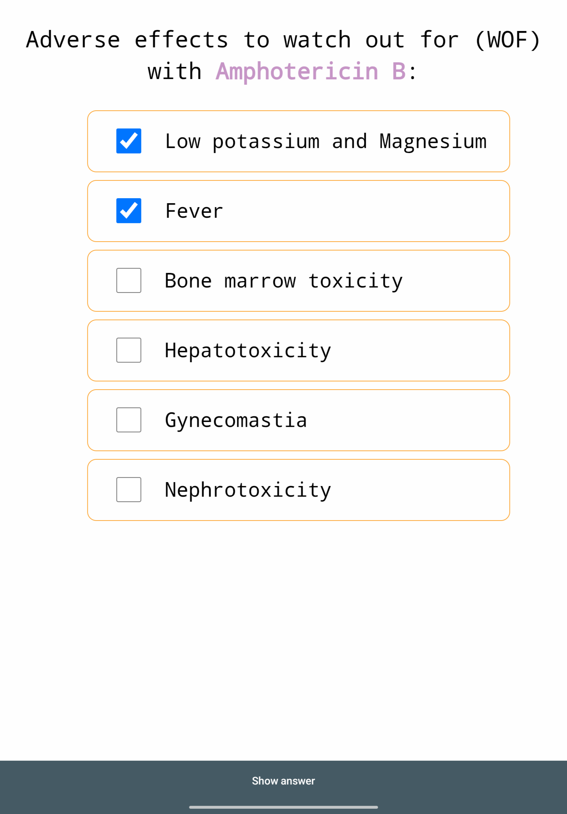
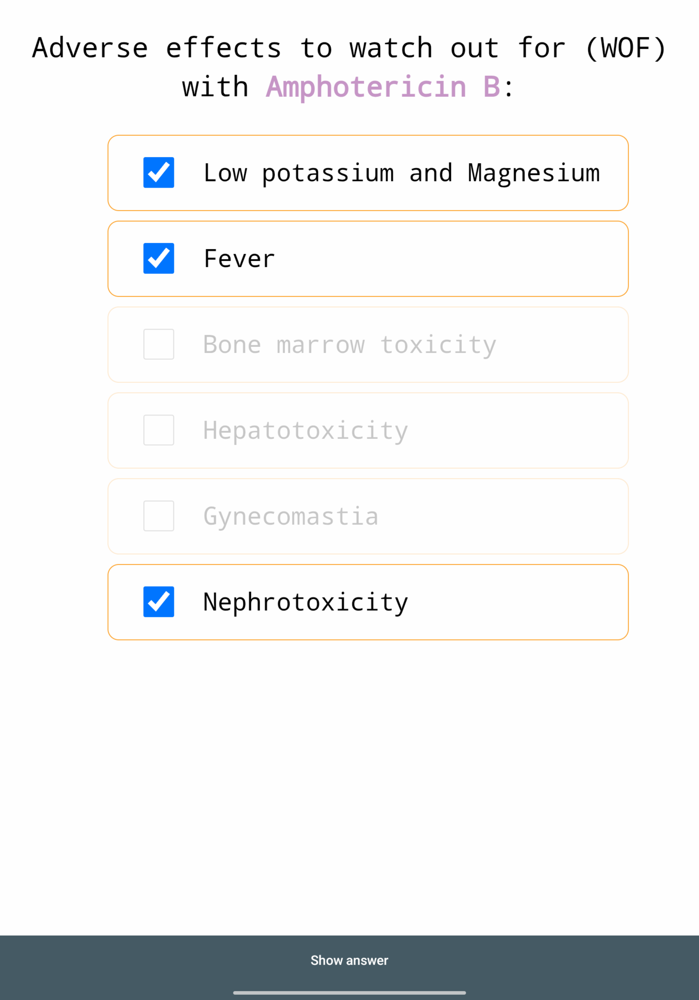
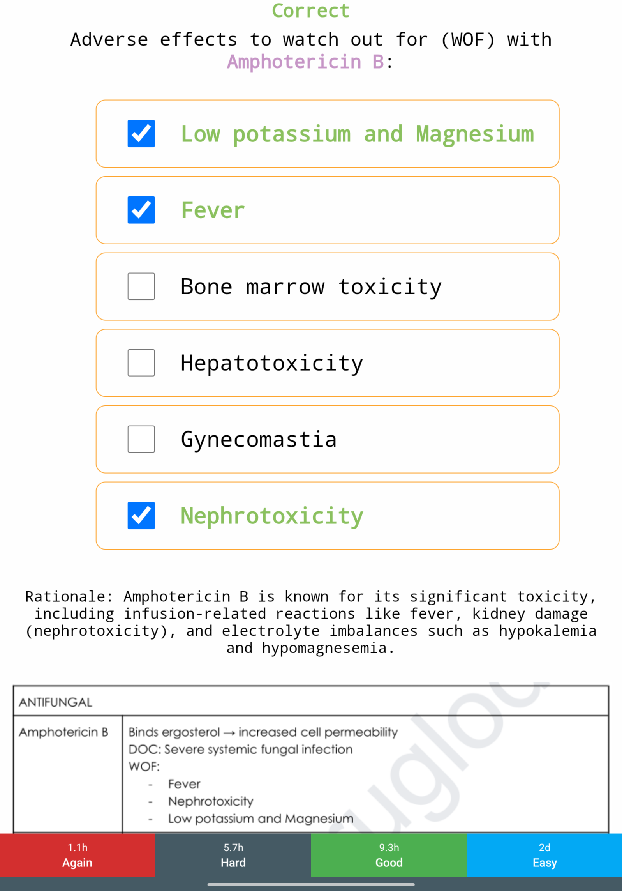
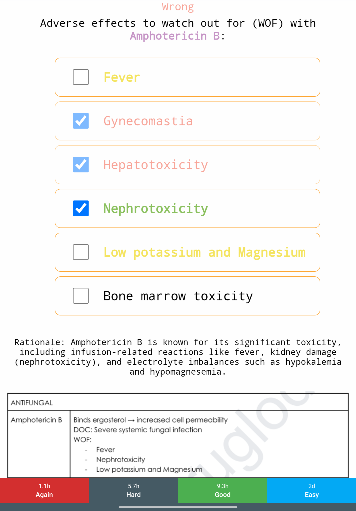
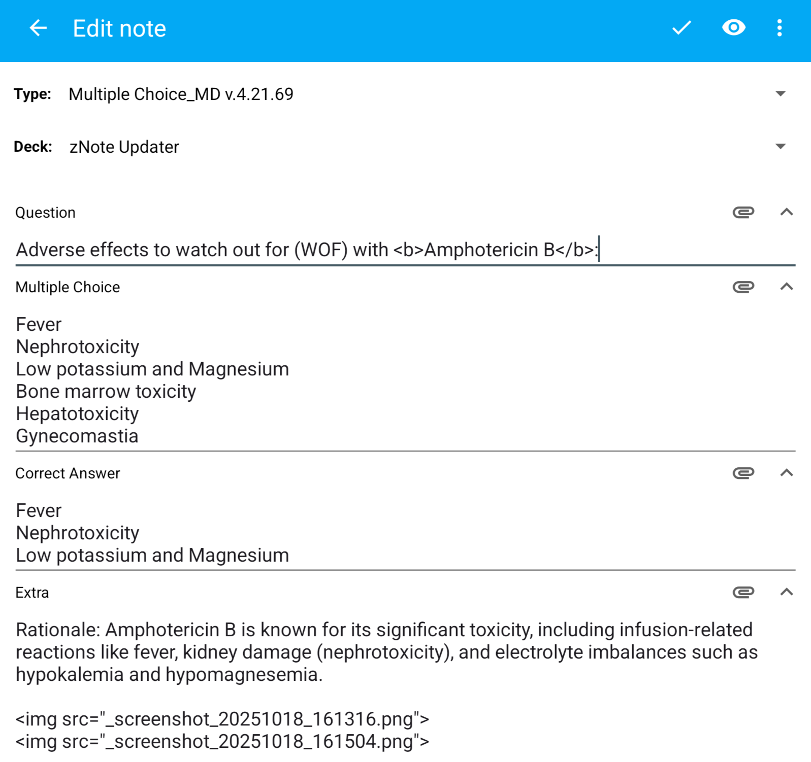

# True-Anki-MCQ-Note-Template
# Advanced Multiple Choice Anki Template

A feature-rich, responsive Anki template for interactive multiple-choice cards. It supports both single & multiple correct answers, randomizes choice order, and provides detailed visual feedback to enhance your study sessions.

This template is designed to be highly configurable directly within the Anki card editor, allowing you to tailor its behavior to your personal workflow.


## Features

-   **Interactive Choices**: Click to select answers directly on the card.
-   **Multiple Correct Answers**: Supports questions where more than one choice is correct.
-   **Randomized Order**: Choices are shuffled on the front of the card to prevent memorizing their position.
-   **Detailed Feedback**: The back of the card clearly marks your answers as `Correct`, `Wrong`, or `Missed`.
-   ✨ **Dynamic Choice Disabling**: Automatically prevents you from selecting more answers than the total number of correct choices, providing a subtle hint without revealing the answer.
-   ✨ **Configurable Auto-Show**: Choose whether multiple-choice options appear immediately or are hidden behind a "Show Choices" button.
-   ✨ **Customizable Keybinds**: Edit the keyboard shortcuts used to reveal the choices.
-   **Mobile-First Design**: Looks and works great across Anki Desktop, AnkiWeb, and AnkiMobile.

## Preview

Here is a step-by-step walkthrough of the template's features, from front to back.

<table>
  <!-- First Row of Images -->
  <tr>
    <td align="center"><strong>1. Front View</strong></td>
    <td align="center"><strong>2. Choices Shown</strong></td>
    <td align="center"><strong>3. Selecting Answers</strong></td>
  </tr>
  <tr>
    <td></td>
    <td></td>
    <td></td>
  </tr>
  
  <!-- Second Row of Images -->
  <tr>
    <td align="center"><strong>4. Selection Limit Reached</strong></td>
    <td align="center"><strong>5. Correct Feedback</strong></td>
    <td align="center"><strong>6. Incorrect Feedback</strong></td>
    <td align="center"><strong>7. Easy Editing</strong></td>
  </tr>
  <tr>
    <td></td>
    <td></td>
    <td></td>
    <td></td>
  </tr>
</table>

## Installation

1.  Download the latest release `.apkg` file from the [Releases page](https://github.com/anki-boi/True-Anki-MCQ-Note-Template/releases).
2.  In Anki, go to `File` > `Import...` and select the downloaded `.apkg` file.
3.  This will add the "Advanced Multiple Choice" note type to your collection. When adding new cards, select this note type.

## Card Fields

To create a card, you need to fill in the following fields:

-   **`Question`**: The question you want to ask.
-   **`Multiple Choice`**: The list of possible answers. **Separate each choice with a `<br>` tag.**
-   **`Correct Answer`**: The correct answer(s). If there are multiple, **separate each one with a `<br>` tag.** The text must exactly match the text in the `Multiple Choice` field.
-   **`Extra`**: (Optional) Any additional information, explanations, or context that will be shown on the back of the card.

## Configuration

You can easily customize the card's behavior by editing the script on the **Front Template**.

1.  Open the Anki Browser and find a card using this note type.
2.  Click the "**Cards...**" button.
3.  In the "Front Template" window, scroll to the top of the `<script>` section.

#### Automatically Show Choices

You can control whether choices are visible immediately or hidden behind a button.

```javascript
// Set to 'true' to show choices automatically.
// Set to 'false' to hide them behind a "Show Choices" button.
const AUTO_SHOW_CHOICES = true;
```

#### Customize Keybinds

If `AUTO_SHOW_CHOICES` is set to `false`, you can edit the keybinds used to trigger the "Show Choices" button.

```javascript
// Add your desired keybinds into the array below. Use lowercase letters.
// To add more keys, just add them to the list, separated by commas.
const KEY_SHOW_CHOICES = ['q', 'c'];
```

## Recent Updates

✨ **New: Dynamic Choice Disabling**
-   When a question has multiple correct answers, the template now dynamically disables unselected choices once you have selected the maximum number of correct answers. This prevents over-selecting and serves as a subtle hint about how many answers are correct.

✨ **New: Configurable Auto-Show & Keybinds**
-   You can now easily toggle whether choices are shown automatically (`AUTO_SHOW_CHOICES = true`) or hidden behind a button (`false`).
-   If choices are hidden, you can now customize the keybinds to reveal them.

🔧 **Change: Removed Hint Button**
-   The previous "Show Hint" button and its associated text have been removed. The new dynamic choice disabling feature serves the same purpose—indicating how many choices to select—in a more intuitive and integrated way, making the old hint button redundant.

## Acknowledgements

This template utilizes a modified version of the `anki-persistence.js` script by [Simon Lammer](https://github.com/SimonLammer/anki-persistence) to preserve your selections between the front and back of the card.

## License

This project is licensed under the MIT License - see the [LICENSE](LICENSE) file for details.